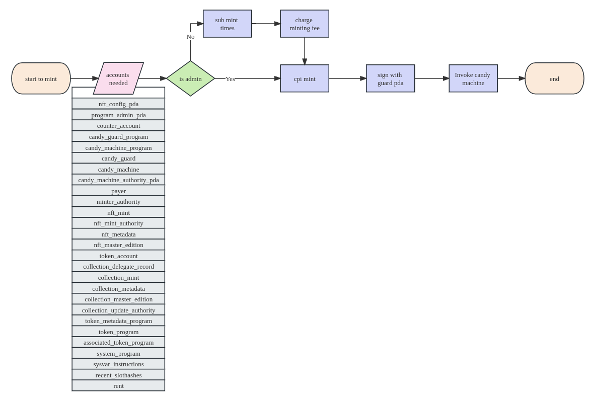
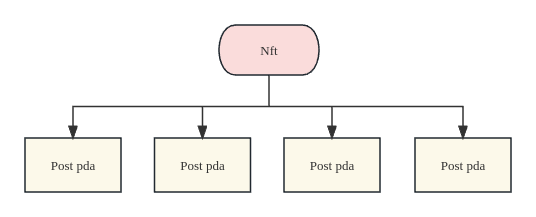

# Introduce

**Roseite** is a fully on-chain SocialFi platform. Importantly, we will use NFTs as a social account instead of a wallet account, achieving greater decentralization while enhancing the practical value of NFTs.

Additionally, due to the unique product model of Roseite, we propose a protocol resembling ERC-6551 to unlock more playstyles and increase the true use value of NFTs.

It's worth noting that the core of this project lies in the implementation of the ERC-6551-like protocol and the product model of account NFTification. Roseite is a bold and innovative attempt, and we hope to apply this model to GameFi or other NFTs in the future, subverting existing playstyles and developing unique ones based on the characteristics of Solana.

<u>This project made a breakthrough from 0 to 1 during the Solana hackathon and will need more time to realize our ideas</u>.


1. ## Advantages:

   1. Greater degree of decentralization: Ownership of the NFT account equates to the possession of all associated properties, including all posts and other potential earnings.
   2. Improved incentivization mechanism: Users can tip high-quality post PDAs directly and the NFT holders attached to these posts can directly claim the profits from the post PDAs — establishing a positive cycle of high-quality content and profits.
   3. Enhanced value of NFTs: The value of NFTs will not be speculative, rather, they will be determined by NFT holders who are able to attract followers by creating engaging content and generating more profitable posts, to elevate traffic for their NFT account. Additionally, these NFTs can be listed for sale in mainstream NFT marketplaces, such as Magic Edgn.
   4. Superior protocol: Leveraging the design of the NFT accounts, we will enact a protocol on Solana that resembles ERC-6551 to facilitate the holding of multiple subsidiary NFTs under primary NFTs. When the ownership of the parent NFT changes, the same happens to the child NFTs, but child NFTs can also be independently transferred.
   5. Better content filtration mechanism: Given Solana's unique modeling mechanism, we hope to encourage high-quality content and minimize irrelevant posts by regulating post PDA rents; ensuring a healthy balance within Roseite.


# SocialFi


## Structure

├── app -- Roseite frontend
│   ├── public
│   └── src
├── images
├── migrations
├── programs
│   └── nft_social_media -- Solana program
├── target -- compiling file
│   ├── bpfel-unknown-unknown
│   ├── debug
│   ├── deploy
│   ├── idl
│   ├── release
│   └── types
├── tests
└── utils -- testing


## Dynamically add mint whitelist

Nfts in Roseite complies with the Metaplex nft standard, and is used with candy guard to dynamically add mint whitelist.




## Post Pda

Roseite was born thanks to Solana's unique Pda model. Posts in Roseite will realize full data on-chain through pda. At the same time, when the ownership of Nft is transferred, new holders will have all post pda under their Nft to achieve the purpose of increasing the value of Nft.




## Potential：

- Because of the transparency of web3, user profiling can be better achieved.
- Using Solana's Lookup table feature, users can store up to 255 * 3MB = 756MB of content on the chain at most.
- According to the unique model of Solana, the extension of the ERC-6551-like protocol makes the gameplay more diverse.
- Applying this set of product models and protocols to the gamefi field is aimed at subverting the existing gameplay of gamefi and NFTs.


# Program

## Building

**note:Please make sure the environment contains anchor, solana-cli, rustc before running this project**

```
anchor build
```

After running the command, the target file will be generated in the root directory


## Deploying

```
anchor deploy
```

According to the Anchor.toml configuration file, deploy the contract to the chain through solana-cli


## Testing

```
anchor test
```

Testing


## Frontend

### Installing

```
cd app
npm install
```

Install dependencies


## Run

```
npm run dev
```

start frontend